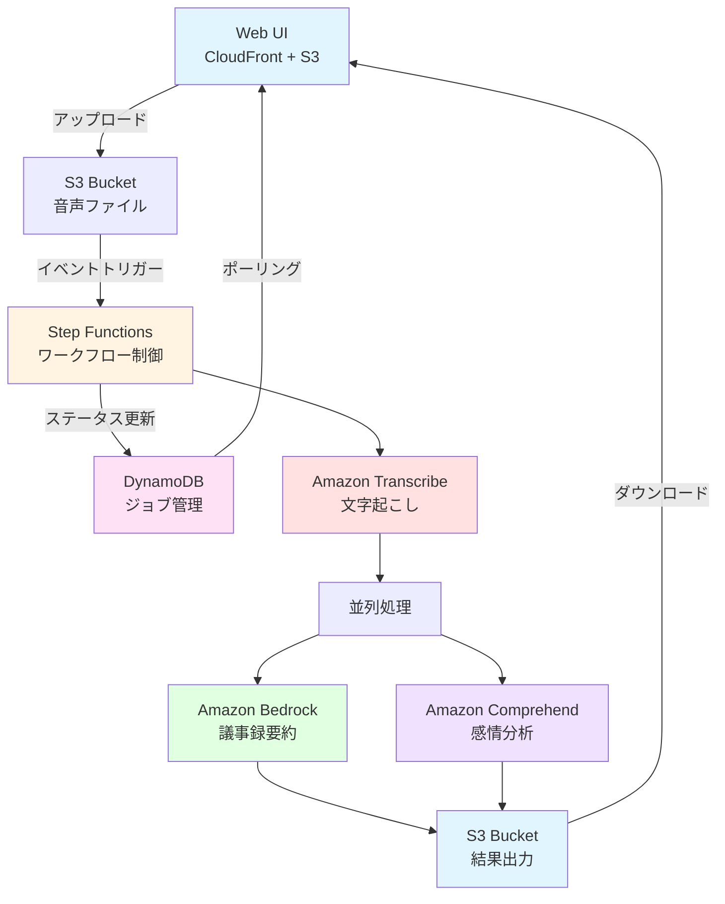

# 議事録AI分析アプリ 🎤
### サーバレスアーキテクチャによる音声文字起こし&感情分析&要約

---

## 📋 システム概要

**音声ファイルから文字起こし、要約、感情分析を生成する**

- 🎯 目的：Teamsの議事録機能の代替として、高精度な文字起こしと感情分析を提供
- ☁️ 完全サーバレス：Lambdaを使わず、マネージドサービスのみで構成
  - Lambdaは言語のバージョン管理などでメンテナンスコストがかかる
- ⚡ イベント駆動：S3イベントトリガー+Step Functionsによる自動処理
- 📊 リアルタイム進捗表示：DynamoDBとプログレスバーで処理状況を可視化

---

## 🏗️ システムアーキテクチャ



---

## 🎯 主要機能

### 1. 音声ファイルアップロード 📁
- 対応フォーマット：MP3、MP4
- ドラッグ&ドロップ対応
- 最大100MBまで対応

### 2. リアルタイム進捗表示 📊
- プログレスバーで処理状況を可視化
- 3秒ごとにステータス更新
- DynamoDBでジョブ管理

### 3. 文字起こし 📝
- Amazon Transcribe使用
- 日本語対応
- 高精度な音声認識

---

## 🎯 主要機能（続き）

### 4. 議事録要約 📋
- Amazon Bedrock (Claude 3.5 Sonnet) 使用
- 会議名、議題の自動抽出
- 決定事項、意見・質問の整理

### 5. 感情分析 😊
- Amazon Comprehend使用
- Positive / Negative / Neutral / Mixed の4段階評価

### 6. 結果ダウンロード 💾
- 文字起こしテキスト
- 議事録要約
- 感情分析結果

---

## 🔧 使用技術スタック

### フロントエンド
- HTML5 / CSS3 / Vanilla JavaScript
- AWS SDK for JavaScript (ブラウザ版)
- Amazon Cognito (認証)

### バックエンド (サーバレス)
- Amazon S3 (ストレージ)
- Amazon DynamoDB (ジョブ管理)
- AWS Step Functions (ワークフロー)
- Amazon Transcribe (文字起こし)
- Amazon Bedrock (要約生成)
- Amazon Comprehend (感情分析)
- Amazon CloudFront (配信)

---

## ⚙️ Step Functions ワークフロー

### 処理フロー
1. **UpdateStatusTranscribing**: DynamoDBステータス更新
2. **Transcribe**: 音声ファイルを文字起こし
3. **UpdateStatusSummarizing**: DynamoDBステータス更新
4. **UpdateStatusAnalyzing**: DynamoDBステータス更新
5. **並列処理**:
   - **Bedrock**: 文字起こしテキストから議事録要約を生成
   - **Comprehend**: 感情分析を実行
6. **UpdateStatusCompleted**: DynamoDBステータス更新
7. **結果保存**: S3に各結果を保存

### 特徴
- 完全マネージド
- 自動リトライ
- 並列処理による高速化
- DynamoDBで進捗状況を管理

---

## 📊 データフロー

### S3バケット構成
```
minutes-app-team-a-backet/
├── input-data/           # アップロード音声ファイル
├── output-transcribe/    # 文字起こし結果 (TXT/JSON)
├── output-bedrock/       # 議事録要約結果 (HTML)
└── output-comprehend/    # 感情分析結果 (tar.gz)
```

### アクセス方式
- アップロード：S3 Direct Upload (Identity Pool認証)
- ダウンロード：S3 Direct Access (Identity Pool認証)
- 進捗管理：DynamoDBポーリング (3秒間隔)

---

## 🎨 Web UI デモ

### メイン画面
- シンプルで直感的なUI
- ドラッグ&ドロップでファイルアップロード
- リアルタイムプログレスバー表示
- 5段階のステータス表示（アップロード→文字起こし→要約→感情分析→完了）

### ダウンロード機能
- ジョブID入力で簡単ダウンロード
- 文字起こしテキスト
- 議事録要約（HTML）
- 感情分析結果（tar.gz）

**URL**: https://d1lygg7omlk19y.cloudfront.net/

---

## 💡 設計のポイント

### 1. Lambda不使用
- Step Functionsの直接統合機能を活用
- コード管理不要、メンテナンス性向上

### 2. イベント駆動
- S3イベントで自動処理開始
- 手動トリガー不要

### 3. 並列処理
- BedrockとComprehendを並列実行
- 処理時間の短縮

### 4. 進捗可視化
- DynamoDBでジョブ状況を管理
- 3秒間隔でポーリング
- プログレスバーでリアルタイム表示

### 5. セキュリティ
- Cognito認証
- IAMロールによる最小権限

---

## 📈 処理性能

- **文字起こし**: 5分の音声を約3分で処理
- **要約生成**: 約30秒
- **感情分析**: 約1分
- **合計処理時間**: 約5分以内

### スケーラビリティ
- マネージドサービスによる自動スケーリング
- 同時処理数の制限なし

---

## 🚀 今後の拡張案

### 機能拡張
- 話者識別機能
- キーフレーズ抽出
- エンティティ認識
- WebSocketでリアルタイム通知

### UI/UX改善
- 複数ファイル同時アップロード
- グラフによる感情分析可視化
- 履歴管理機能
- 処理時間の予測表示

---

## 📝 まとめ

### 実現できたこと
✅ 完全サーバレスアーキテクチャ  
✅ Lambda不使用でシンプルな構成  
✅ 高精度な文字起こしと感情分析  
✅ リアルタイム進捗表示機能  
✅ 使いやすいWeb UI  
✅ 低コスト・高スケーラビリティ  

### 学んだこと
- Step Functionsの直接統合の強力さ
- DynamoDBとStep Functionsの連携
- マネージドサービスの組み合わせ方
- サーバレスアーキテクチャの設計思想

---

## 🙏 ご清聴ありがとうございました

### デモURL
https://d1lygg7omlk19y.cloudfront.net/

### GitHubリポジトリ
https://github.com/kyonosuke-specialist/gijirokuapp

### 質問・ディスカッション
お気軽にご質問ください！
